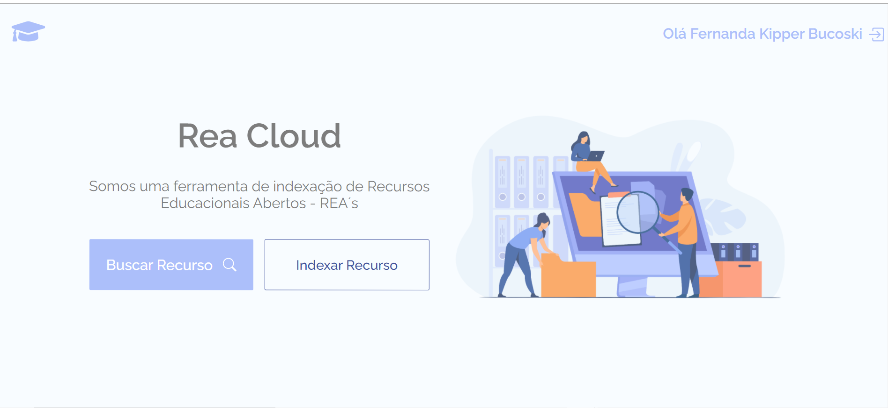
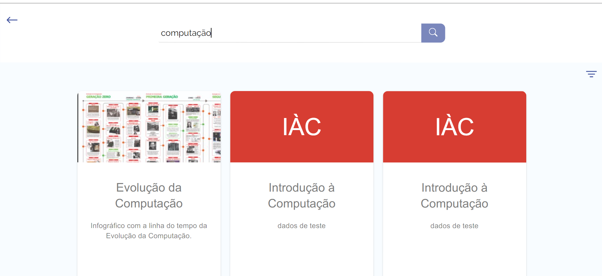

# ReaCloud 🎓
## Indexador de Recursos Educacionais Abertos

O ReaCloud é um indexador digital para [Recursos Educacionais Abertos](https://www.gov.br/capes/pt-br/acesso-a-informacao/acoes-e-programas/educacao-a-distancia/uab/rea#:~:text=Recursos%20Educacionais%20Abertos%20(REA)%20s%C3%A3o,utilizados%20ou%20adaptados%20por%20terceiros.), todos usuários que desejam contribuir com o mundo acadêmico podem acessar a ferramenta
para visualizar os recursos indexados ou compartilhar novos recursos com os demais usuários. Desenvolvido na Universidade Federal de Pelotas, o ReaCloud surgiu em decorrência da necessidade de locais adequados para o armazenamento dos metadados desses recursos, os quais muitas vezes acabam-se perdidos e não reaproveitados.

Seguindo o padrão de metadados Dublin Core o indexador armazena as principais informações a respeito de um Recurso Educacional Aberto, incluindo seu link externo onde o usuário poderá baixar ou apenas visualizar o material - os materiais podem ser de qualquer natureza como livros, softwares, videos, podcasts, banners etc.

   
   

